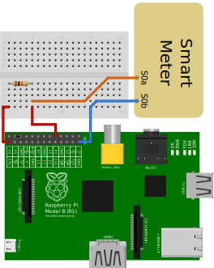

# POWERPI
Logs the electric energy consumption in the hq with the power of a raspberry and a flying circus.

## Voraussetzungen

### Hardware
  * Raspberry Pi B2
  * Stromzähler mit S0-Schnittstelle
  * $Server
 
### Software

#### RaspberryPi
  * Raspbian 7.8
  * python 3.2
    * requests >= 2.5 (installierbar via pip)

#### Server
  * Apache >= 2.2
  * php5 >= 5.0
  * rrdtool >= 1.4
  * cron
  
## Bestandteile
Das Setup besteht aus zwei Bestandteilen. Der eine läuft auf einem RasPi der im Sicherungskasten im HQ hängt und die Impulse vom Stromzähler abgreift. Der Andere Teil läuft auf unserem Server, auf der VM mtbf. Dieser Teil nimmt die Rohdaten vom RasPi entgegen, schreibt sie in eine RRD und erzeugt einmal in der Minute hypsche Bilder daraus.

## Installation

### Hardwareverdrahtung

### Raspberry Pi
Inhalt des Unterordners *pi* auf einen RasPi kopieren, auf dem ein Raspbian läuft. Das Script *power.py* muss in den Ordner /srv/powerpi und das Script *powerpi* in den Ordner /etc/init.d/ kopieren.
Das Script `/srv/powerpi/power.py` muss für root ausführbar sein.

#### AutoStart 

Damit der Daemon automatisch gestartet wird muss der Befehl `insserv -d /etc/init.d/powerpi` als root ausgeführt werden.

### Server
In diesem Beispiel liegen die Daten auf dem Webserver unter  `/srv/powerpi/`

Auf dem Webserver muss das Script *get.php* sowie *index.php* und *\*.png* erreichbar sein. Die Datei `get.php` muss ausschließlich für den RaspberryPi erreichbar sein, die index.php und die generierten *.png für jeden der sich den Stromverbauch anschauen darf. 

#### Apache Config für passenden vhost

Ich gehe davon aus, dass für das Strommonitoring eine eigenen Subdomain verwedent wird, die nur über https erreichbar ist und für das für die ssl Verbindung ein von *cacert* signiertes Zertifikat verwendet wird.

    <IfModule mod_ssl.c>
    <VirtualHost *:443>
	ServerAdmin webmaster@example.com
	ServerName power.example.com
	
	DocumentRoot /srv/powerpi/
	<Directory />
		Options FollowSymLinks
		AllowOverride None
	</Directory>
	<Directory /srv/powerpi/>
		Options Indexes FollowSymLinks MultiViews
		AllowOverride AuthConfig
		Order allow,deny
		allow from all
	</Directory>

	ErrorLog ${APACHE_LOG_DIR}/error.log
	LogLevel notice 
	CustomLog ${APACHE_LOG_DIR}/ssl_access.log combined
	SSLEngine on

	SSLCertificateFile    /etc/ssl/certs/cert.crt
	SSLCertificateKeyFile /etc/ssl/private/cert.key

	SSLCertificateChainFile /etc/ssl/certs/class3.crt

	#SSLOptions +FakeBasicAuth +ExportCertData +StrictRequire
	<FilesMatch "\.(cgi|shtml|phtml|php)$">
		SSLOptions +StdEnvVars
	</FilesMatch>
    </VirtualHost>
    </IfModule>

#### cronjob

der Cronjob wird jeden Minute aufgerufen und erzeugt jeweils die aktuellen Kurven aus rrd heraus.

    * * * * * /srv/powerpi/rrd.sh > /dev/null 2>&1

## TODO

  - ✔ - config Datei für power.py
      - ✔ - wird ssl genutzt, oder nicht, http-basic-auth (ja/nein), wenn ja: Zugangsdaten
      - ✔ - "rrd"-Server
  - .htaccess Setup (mindestens erklären wie man es einrichtet)
  - leere power.rrd
    - rrd gen-script für ein Jahr ohne Datenverlust; aber nur ein rra
  - rrd für den Apachen unzugänglich ablegen
  - Schritt-für-Schritt Anleitung (vielleicht)
  - Schleife zum für den erneuten Senderversuch wenn der Server nicht erreichbar ist
    - wie lange soll es erneut versucht werden?